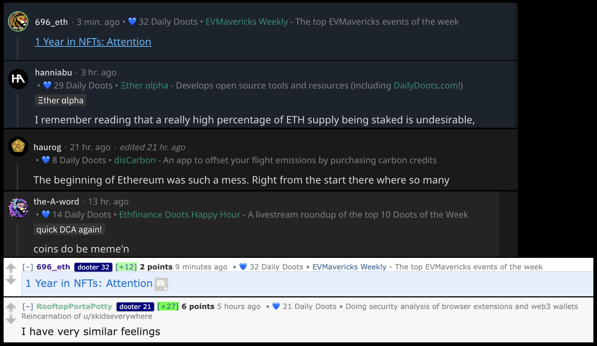

# EthFinance Buddy

This is an extension for Chromium-based browsers and ~~and Firefox~~* to display user details for EthFinance contributors on old/new Reddit and [Kbin](https://kbin.social/m/ethfinance/).

\* EthFinance Buddy does not currently work Firefox

User details:
- Daily doot count
- Profile
- Delegate info (soon™)

Kbin features:
- Sort comments by new as default
- Bring the comment box to the top of the comments
- Make comments collapsible
- Opens comment links in new tabs
- Highlights and scrolls to linked comments

**Adding the extension**

1. Download this repo and move the files to your desired location.
1. Features can be toggled on/off in the `settings.js` file. You will need to reload your extension if you change these settings after you have it installed. Change the setting to `false` to disable and `true` to enable.
1. For Chromium-based browsers:
	1. Open a new tab and enter `chrome://extensions/` into the address bar and press enter.
	1. In the upper right turn on "Developer mode".
	1. In the upper left select "Load unpacked".
	1. Select the folder with the files you downloaded from the repo.
1. ~~For Firefox:~~
	1. ~~Open a new tab and enter `about:debugging` into the address bar and press enter.~~
	1. ~~On the left sidebar select "This Firefox".~~
	1. ~~Under the "Temporary Extensions" section select "Load Temporary Add-on".~~
	1. ~~A file selector will appear, double click on the `manifest.json` file.~~
